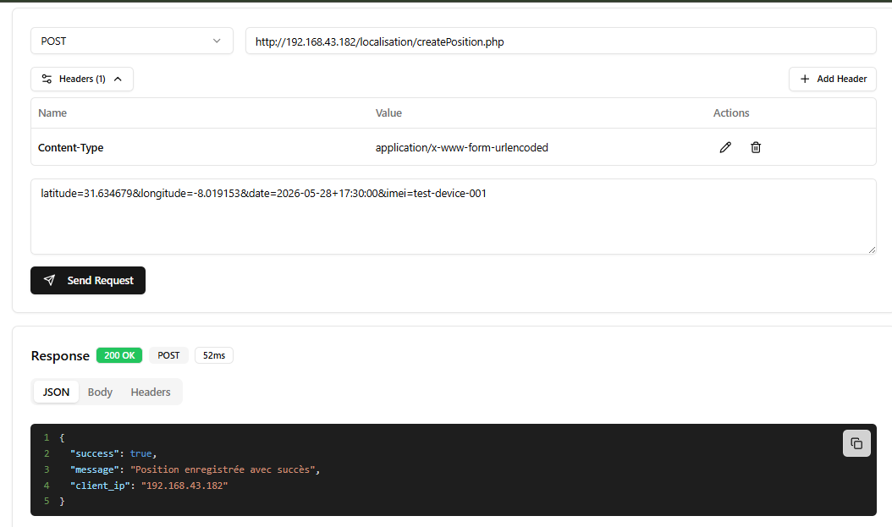
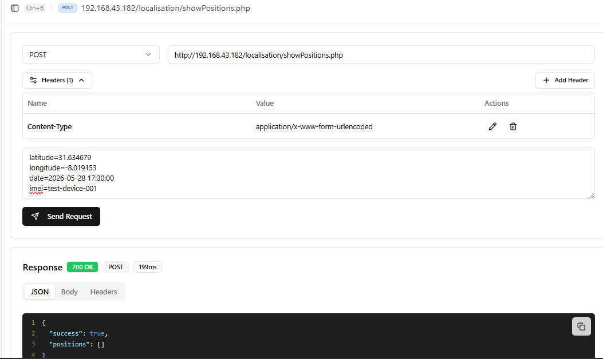
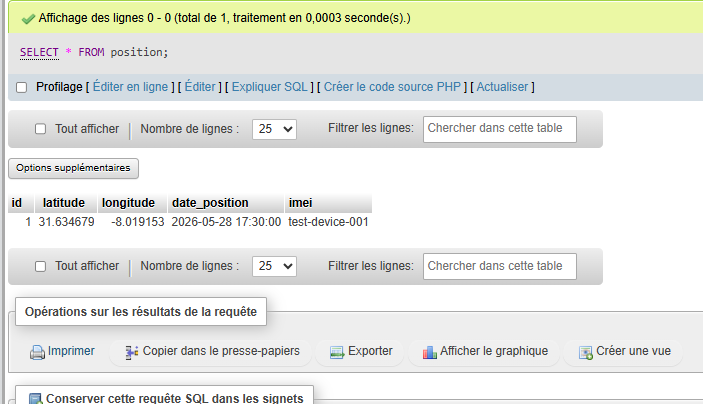
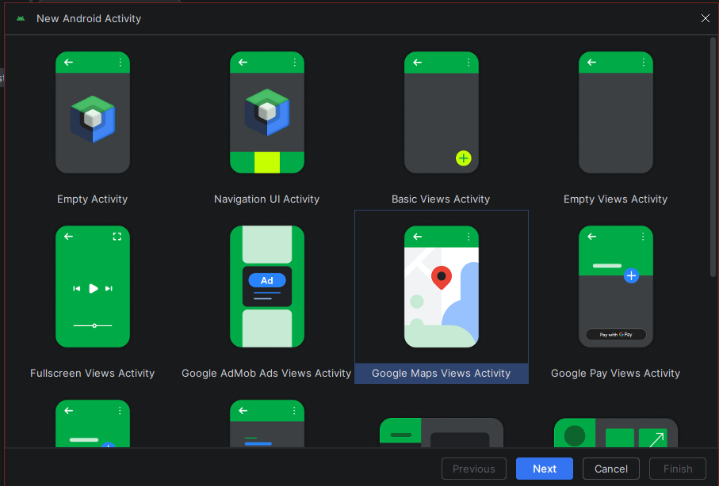

https://github.com/user-attachments/assets/a9ba1a85-8d0b-4a99-b25f-92d82414726a

# 🌍 GeoPulse Live – LAB 12

Application Android de **localisation en temps réel** permettant de récupérer les coordonnées GPS d’un appareil mobile, de les envoyer vers un backend PHP/MySQL, puis de les afficher sur une carte Google Maps sous forme de marqueurs.

Ce laboratoire met en place une chaîne complète :

```text
Android GPS → Volley HTTP POST → PHP API → MySQL → JSON API → Google Maps Markers
```

---

## 🎯 Objectif du laboratoire

Le but de ce laboratoire est de :

- Comprendre l’utilisation du **GPS Android** avec Java
- Gérer les **permissions runtime** de localisation
- Envoyer des données depuis Android vers un serveur avec **Volley**
- Créer une API PHP basée sur une architecture organisée
- Stocker les positions GPS dans une base **MySQL**
- Récupérer les positions sous forme de **JSON**
- Afficher les coordonnées enregistrées sur **Google Maps**
- Produire une application complète, fonctionnelle et visuellement moderne

---

## 🧭 Description de l’application

**GeoPulse Live** est une application mobile qui permet de suivre et visualiser des positions GPS.

L’application contient deux parties principales :

### 📍 Partie Android GPS

L’application récupère les coordonnées GPS de l’appareil, puis envoie automatiquement les données vers le serveur local.

Données envoyées :

- Latitude
- Longitude
- Date et heure de capture
- Identifiant de l’appareil

### 🗺️ Partie Google Maps

L’activité Google Maps récupère les positions enregistrées dans MySQL à travers une API JSON, puis affiche chaque position sous forme de marqueur sur la carte.

---

## ✨ Fonctionnalités

- Récupération de la position GPS en temps réel
- Demande automatique de permission localisation
- Envoi des coordonnées vers une API PHP
- Insertion des données dans une table MySQL
- Récupération des positions au format JSON
- Affichage dynamique des marqueurs sur Google Maps
- Utilisation de Google Maps Activity
- Interface Android personnalisée avec :
  - Fond en dégradé
  - Cartes arrondies
  - Bouton moderne
  - Couleurs harmonieuses
  - Présentation claire des coordonnées

---

## 🧰 Technologies utilisées

| Catégorie | Technologies |
|---|---|
| Mobile | Android Studio, Java, XML |
| Réseau | Volley |
| Localisation | Android LocationManager |
| Carte | Google Maps SDK |
| Backend | PHP |
| Base de données | MySQL |
| Serveur local | XAMPP |
| Format d’échange | JSON |
| API minimum | Android 7.0 / API 24 |

---

## ▶️ Démonstration

Une démonstration vidéo complète est disponible dans le dossier **Demo** du repository.

```text
Demo/
└── demo_geopulse_live.mp4
```

La vidéo montre :

- La création et la configuration de Google Maps Activity
- Le test de l’API `createPosition.php`
- L’insertion d’une position dans MySQL
- Le test de l’API `showPositions.php`
- La récupération JSON des positions
- Le fonctionnement global du système

---

## 🗄️ Base de données

### Base utilisée

```sql
CREATE DATABASE localisation;
```

### Table utilisée

La table utilisée dans ce laboratoire est :

```sql
CREATE TABLE position (
  id int(11) NOT NULL PRIMARY KEY AUTO_INCREMENT,
  latitude double NOT NULL,
  longitude double NOT NULL,
  date_position datetime NOT NULL,
  imei varchar(80) NOT NULL
);
```

### Structure finale

| Champ | Type | Rôle |
|---|---|---|
| id | int | Identifiant unique auto-incrémenté |
| latitude | double | Latitude GPS |
| longitude | double | Longitude GPS |
| date_position | datetime | Date et heure de capture |
| imei | varchar(80) | Identifiant de l’appareil |

---

## 🧩 Architecture globale

```text
GeoPulseLive/
│
├── Android App
│   ├── MainActivity.java
│   ├── LiveMapActivity.java
│   ├── activity_main.xml
│   └── activity_live_map.xml
│
└── PHP Backend
    ├── model/
    │   └── GeoPoint.php
    ├── database/
    │   └── DbConnector.php
    ├── contract/
    │   └── CrudGateway.php
    ├── service/
    │   └── GeoPointService.php
    ├── createPosition.php
    └── showPositions.php
```

---

## 🖥️ Backend PHP

Le backend est placé dans le dossier :

```text
C:\xampp\htdocs\localisation
```

### Arborescence backend

```text
localisation/
├── model/
│   └── GeoPoint.php
├── database/
│   └── DbConnector.php
├── contract/
│   └── CrudGateway.php
├── service/
│   └── GeoPointService.php
├── createPosition.php
└── showPositions.php
```

---

## 📌 Rôle des fichiers PHP

### `model/GeoPoint.php`

Représente une position GPS comme un objet.

Il contient :

- id
- latitude
- longitude
- date de capture
- identifiant appareil

---

### `database/DbConnector.php`

Gère la connexion à la base MySQL avec PDO.

Ce fichier permet :

- D’ouvrir une connexion vers MySQL
- D’activer les erreurs PDO
- De centraliser la configuration de la base de données

---

### `contract/CrudGateway.php`

Définit une interface commune pour les opérations principales.

Elle contient :

- `insert()`
- `findAll()`

---

### `service/GeoPointService.php`

Contient la logique d’accès aux données.

Il permet de :

- Insérer une nouvelle position
- Lire toutes les positions
- Adapter le champ PHP `date` à la colonne MySQL `date_position`

---

### `createPosition.php`

Endpoint utilisé pour enregistrer une position envoyée depuis Android.

Il reçoit :

```text
latitude
longitude
date
imei
```

Puis il insère les données dans MySQL.

---

### `showPositions.php`

Endpoint utilisé par l’activité Google Maps.

Il renvoie les positions au format JSON afin de les afficher sur la carte.

---

## 🌐 API REST locale

### 1. Insertion d’une position

```http
POST http://192.168.43.182/localisation/createPosition.php
```

Header :

```http
Content-Type: application/x-www-form-urlencoded
```

Body :

```text
latitude=31.634679&longitude=-8.019153&date=2026-05-28+17:30:00&imei=test-device-001
```

Réponse attendue :

```json
{
  "success": true,
  "message": "Position enregistrée avec succès",
  "client_ip": "192.168.43.182"
}
```

### Capture du test `createPosition.php`



---

### 2. Récupération des positions

```http
POST http://192.168.43.182/localisation/showPositions.php
```

Réponse attendue :

```json
{
  "success": true,
  "positions": [
    {
      "id": "1",
      "latitude": "31.634679",
      "longitude": "-8.019153",
      "date": "2026-05-28 17:30:00",
      "imei": "test-device-001"
    }
  ]
}
```

### Capture du test `showPositions.php`



---

## ✅ Test réussi du backend

Après l’envoi d’une position avec `createPosition.php`, la réponse JSON confirme que l’insertion a été réalisée correctement.



Ce test valide que :

- L’API reçoit bien les paramètres
- La méthode POST fonctionne correctement
- La connexion PHP/MySQL est fonctionnelle
- La position est enregistrée avec succès

---

## 📱 Partie Android

### `AndroidManifest.xml`

Le manifeste contient les permissions nécessaires :

```xml
<uses-permission android:name="android.permission.ACCESS_FINE_LOCATION" />
<uses-permission android:name="android.permission.ACCESS_COARSE_LOCATION" />
<uses-permission android:name="android.permission.INTERNET" />
<uses-permission android:name="android.permission.READ_PHONE_STATE" />
```

L’application autorise aussi les requêtes HTTP locales :

```xml
android:usesCleartextTraffic="true"
```

La clé Google Maps est déclarée avec :

```xml
<meta-data
    android:name="com.google.android.geo.API_KEY"
    android:value="${MAPS_API_KEY}" />
```

---

## 🔑 Clé Google Maps

La clé API Google Maps est placée dans :

```text
local.properties
```

Sous la forme :

```properties
MAPS_API_KEY=YOUR_GOOGLE_MAPS_API_KEY
```

Le fichier `local.properties` ne doit pas être poussé sur GitHub.

---

## 🗺️ Création de Google Maps Activity

Une deuxième activité a été créée pour afficher les positions sur une carte.

Nom de l’activité :

```text
LiveMapActivity
```

Nom du layout :

```text
activity_live_map.xml
```

Cette activité utilise :

- `SupportMapFragment`
- `GoogleMap`
- `OnMapReadyCallback`
- `JsonObjectRequest`
- `MarkerOptions`
- `LatLng`

### Capture de création de l’activité Google Maps



---

## ⚙️ Paramètres de Google Maps Activity

Pendant la création de l’activité, les paramètres principaux ont été configurés afin d’intégrer correctement Google Maps dans l’application.

### Capture des paramètres de Google Maps Activity


---

## 🎨 Interface graphique

L’application utilise une interface personnalisée afin d’éviter un rendu basique.

### Éléments visuels utilisés

- Fond en dégradé bleu/violet
- Cartes arrondies effet moderne
- Boutons colorés
- Textes hiérarchisés
- Section GPS claire et lisible
- Design adapté à une démonstration académique

### Fichiers de design

```text
res/drawable/
├── bg_screen_orbit.xml
├── bg_glass_card.xml
├── bg_metric_card.xml
└── bg_location_button.xml
```

---

## 🧪 Tests réalisés

### Test 1 — Création de la base et vérification de la table

Commande utilisée :

```sql
SELECT * FROM position;
```

Résultat attendu :

```text
La table existe et peut recevoir des positions GPS.
```

---

### Test 2 — Insertion via API PHP

Endpoint testé :

```text
createPosition.php
```

Résultat obtenu :

```json
{
  "success": true,
  "message": "Position enregistrée avec succès"
}
```

Capture associée :


Ce test valide que le backend reçoit bien les paramètres envoyés en POST.

---

### Test 3 — Vérification dans MySQL

Commande utilisée :

```sql
SELECT * FROM position;
```

Résultat attendu :

```text
Une nouvelle ligne apparaît dans la table position.
```

---

### Test 4 — Récupération JSON

Endpoint testé :

```text
showPositions.php
```

Résultat attendu :

```json
{
  "success": true,
  "positions": [...]
}
```

Capture associée :


Ce test valide que l’API peut renvoyer les positions stockées.

---

### Test 5 — Création et configuration de Google Maps Activity

L’activité Google Maps a été ajoutée au projet Android afin d’afficher les positions GPS enregistrées.

Captures associées :


---

### Test 6 — Permission GPS Android

Au lancement de l’application, Android demande la permission de localisation.

Résultat attendu :

```text
La permission est demandée et l’application démarre le suivi GPS après acceptation.
```

---

### Test 7 — Envoi depuis l’application Android

Lorsque la position est détectée, l’application envoie automatiquement :

- latitude
- longitude
- date
- identifiant appareil

vers `createPosition.php`.

Résultat attendu :

```text
Une nouvelle position apparaît dans MySQL.
```

---

### Test 8 — Affichage Google Maps

En cliquant sur le bouton :

```text
Afficher la carte
```

L’application ouvre Google Maps et affiche les positions enregistrées sous forme de marqueurs.

Résultat attendu :

```text
Les marqueurs apparaissent sur la carte.
```

---

## 📸 Captures d’écran du laboratoire

Les captures utilisées dans ce rapport sont disponibles dans le dossier :

```text
screenshots/
├── createposition_rest-client.png
├── google_maps_activity-creation.png
├── google_maps_activity_parameters .png
├── showpositions_rest-client.png
└── test-reussi.png
```

### Galerie des captures

| Test API createPosition | Test API showPositions |
|---|---|
|  |  |

| Création Google Maps Activity | Paramètres Google Maps Activity |
|---|---|
|  |  |

| Test réussi |
|---|
|  |

---

## 🧭 Scénario de démonstration

Le scénario suivi dans la vidéo de démonstration est :

```text
1. Lancement de XAMPP
2. Vérification de la base MySQL
3. Test de createPosition.php
4. Vérification de l’insertion
5. Test de showPositions.php
6. Création de Google Maps Activity
7. Configuration de la clé Google Maps
8. Lancement de l’application Android
9. Autorisation de la localisation
10. Affichage latitude / longitude / précision
11. Envoi automatique vers le serveur
12. Ouverture de Google Maps
13. Affichage des marqueurs enregistrés
```

---

## ⚙️ Configuration réseau

Pour un téléphone physique, l’application utilise l’adresse IP du PC serveur :

```text
http://192.168.43.182/localisation/
```

Le téléphone et le PC doivent être connectés au même réseau Wi-Fi ou hotspot.

Pour un émulateur Android, l’adresse peut être remplacée par :

```text
http://10.0.2.2/localisation/
```

---

## 🧠 Points techniques importants

- `localhost` ne fonctionne pas depuis un téléphone physique
- L’adresse IP utilisée doit être celle du PC qui exécute XAMPP
- Apache et MySQL doivent être démarrés
- Le téléphone et le PC doivent être sur le même réseau
- La permission GPS doit être acceptée
- La clé Google Maps doit être valide
- Le trafic HTTP local nécessite `usesCleartextTraffic="true"`
- Le champ envoyé sous le nom `date` est stocké dans MySQL sous le champ `date_position`

---

## 🛡️ Améliorations apportées

Cette version du laboratoire contient plusieurs améliorations par rapport à une version basique :

- Architecture PHP personnalisée
- Noms de classes plus clairs et différents
- Utilisation de PDO
- Requêtes préparées
- Validation des paramètres côté serveur
- Réponses JSON structurées
- Support de `ANDROID_ID` pour identifier l’appareil
- Interface Android personnalisée
- Marqueurs Google Maps avec détails
- Organisation professionnelle du projet

---

## 📂 Structure finale du repository

```text
GeoPulseLive/
├── app/
│   └── src/
│       └── main/
│           ├── java/com/malak/geopulselive/
│           │   ├── MainActivity.java
│           │   └── LiveMapActivity.java
│           ├── res/
│           │   ├── layout/
│           │   ├── drawable/
│           │   └── values/
│           └── AndroidManifest.xml
│
├── backend/
│   └── localisation/
│       ├── model/
│       ├── database/
│       ├── contract/
│       ├── service/
│       ├── createPosition.php
│       └── showPositions.php
│
├── Demo/
│   └── demo_geopulse_live.mp4
│
├── screenshots/
│   ├── createposition_rest-client.png
│   ├── google_maps_activity-creation.png
│   ├── google_maps_activity_parameters .png
│   ├── showpositions_rest-client.png
│   └── test-reussi.png
│
└── README.md
```

---

## ✅ Résultat final

À la fin du laboratoire, l’application permet de :

- Capturer une position GPS depuis Android
- Envoyer les coordonnées vers un serveur PHP
- Stocker les données dans MySQL
- Récupérer l’historique des positions
- Afficher les positions sur Google Maps

---

## 🏁 Conclusion

Ce laboratoire met en œuvre une application mobile complète combinant :

- Programmation Android en Java
- Localisation GPS
- Communication réseau avec Volley
- Backend PHP
- Base de données MySQL
- Consommation JSON
- Google Maps SDK

Il permet de comprendre comment une application mobile peut collecter des données de localisation, les stocker sur un serveur local et les afficher visuellement sur une carte interactive.

**GeoPulse Live** constitue ainsi une base solide pour développer des systèmes plus avancés de suivi GPS, de géolocalisation temps réel ou de supervision mobile.
